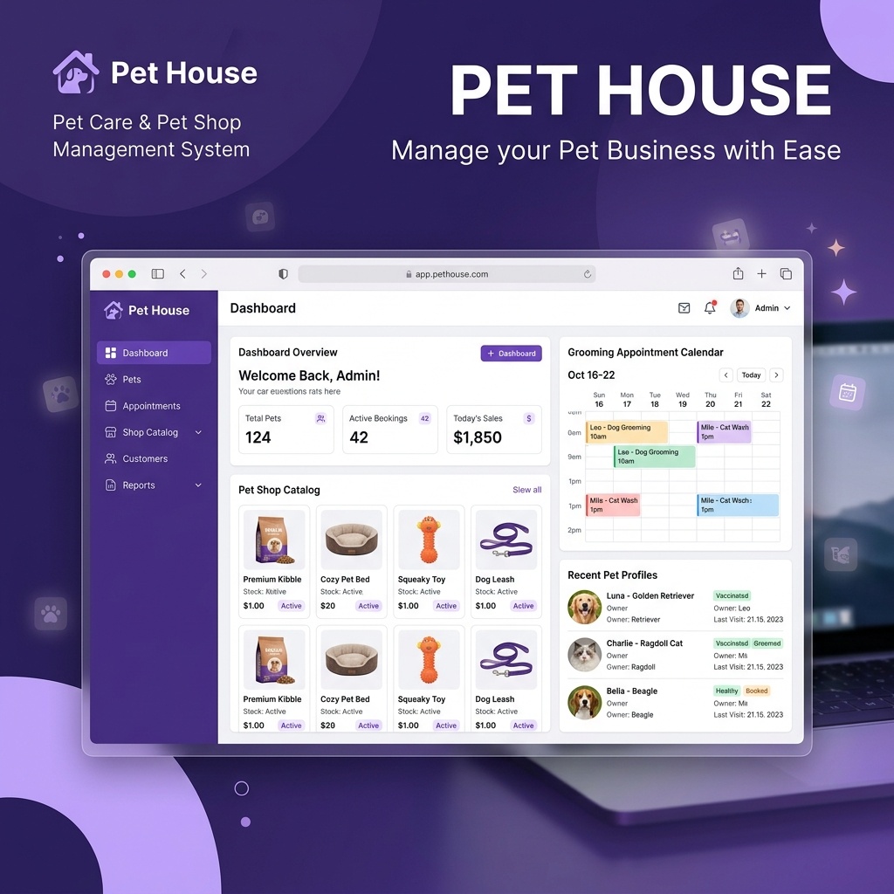
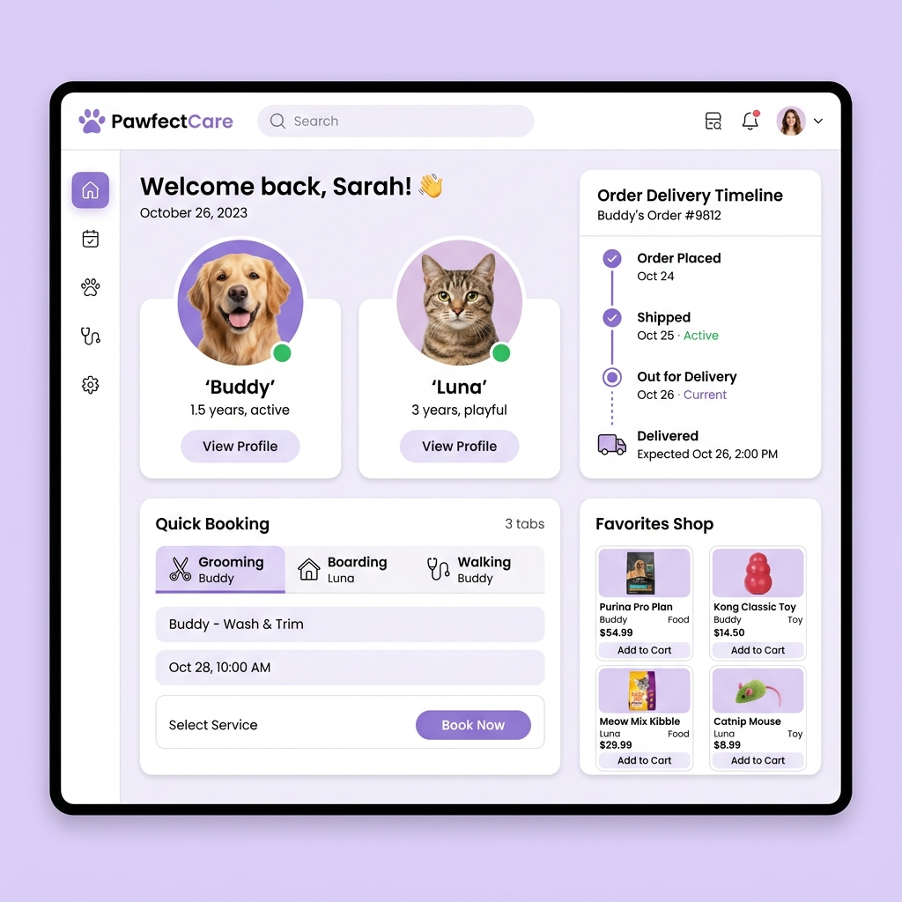
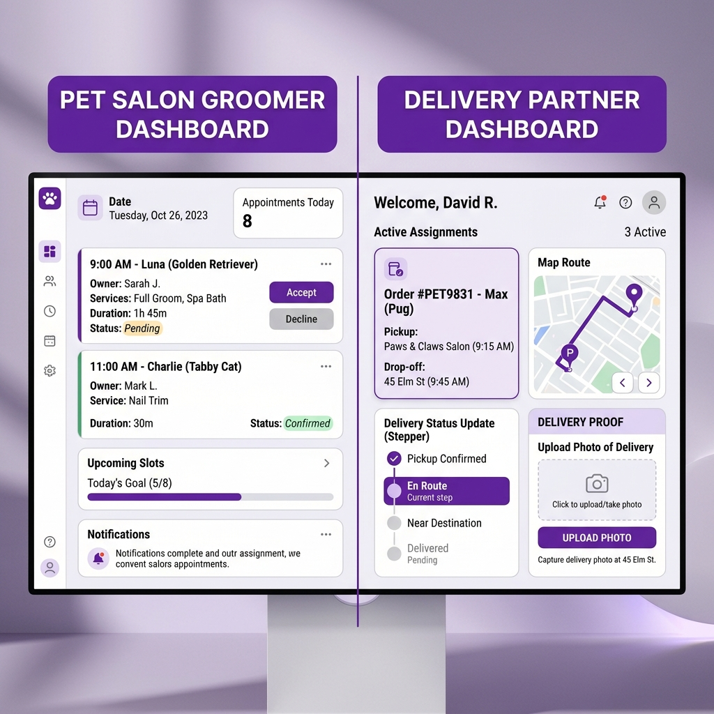
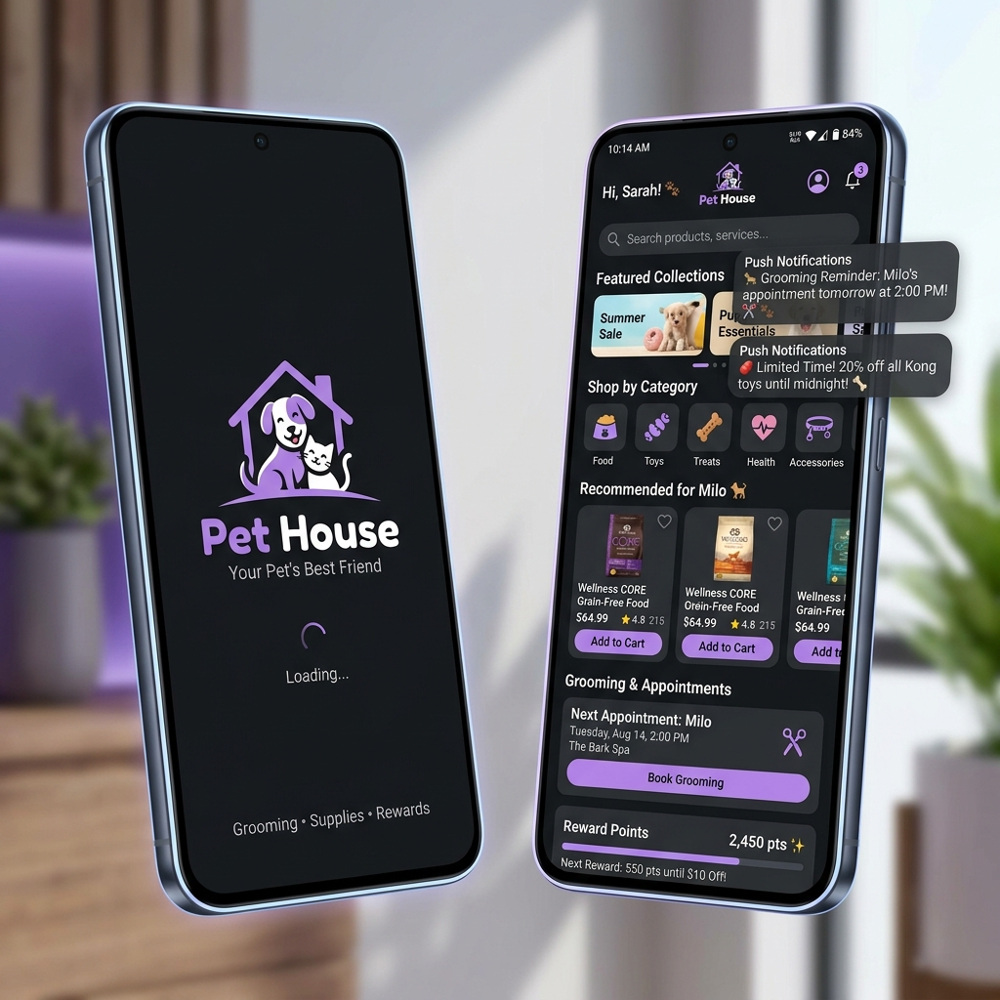

# 🐾 Pet House — Pet Shop & Pet Salon Management System



A modern, full-stack pet care ecosystem built with **Core PHP 8.3 + MySQL (PDO) + Bootstrap 5 + Android Kotlin Companion App**.

Pet House provides an end-to-end management system for pet owners, grooming salons, pet food & supply shops, and delivery partners with real-time tracking and role-based access control.

---

## 📋 Table of Contents

- [✨ Key Features](#-key-features)
- [🖼️ System UI Previews](#️-system-ui-previews)
- [📱 Android Companion App](#-android-companion-app)
- [🧰 Tech Stack](#-tech-stack)
- [📁 Folder Structure](#-folder-structure)
- [🔑 Default Login Accounts](#-default-login-accounts)
- [🚀 Quick Start & Installation](#-quick-start--installation)
- [⚙️ System Configuration](#️-system-configuration)
- [🔒 Security Architecture](#-security-architecture)
- [🧪 Troubleshooting](#-troubleshooting)
- [📜 License & Credits](#-license--credits)

---

## ✨ Key Features

### 🔐 Multi-Role Authentication & Access Control
- Login via **Email or Phone Number** with `bcrypt` password security (`cost = 10`).
- Role-based access control: **Admin · Customer · Groomer · Delivery Partner**.
- Strict CSRF protection per-session using timing-safe token verification (`hash_equals`).
- Customer self-registration with automatic welcome bonus points & referral code generation.

### 🛒 Customer Experience & E-Commerce
- **Personalized Dashboard:** Quick actions, order status badges, daily pet tips, featured items.
- **Pet Shop:** Product filtering, live search, sorting, category views, low-stock warnings, and ratings.
- **AJAX Shopping Cart & Checkout:** Quantity adjustment without page reloads, promo coupon validation, automatic tax calculation, and free delivery thresholds.
- **Pet Management:** Register and manage pet profiles (dogs, cats, birds, etc.) with photo uploads and medical notes.
- **Service Bookings:** Schedule **Grooming, Boarding, and Walking** services with dedicated status tracking.
- **Rewards & Loyalty Program:** Earn points per purchase, tier upgrades (Bronze → Platinum), and referral bonuses.



### ✂️ Groomer Salon Portal
- Real-time appointment queue with **Start** and **Complete** workflow states.
- Incoming appointment requests with Accept/Decline actions.
- Full client booking history with date filtering and search.
- Personal schedule and stats management.

### 🚚 Delivery Partner Portal
- Active order assignments with step-by-step progress: `Picked Up` → `Out for Delivery` → `Delivered`.
- **Proof of Delivery:** Mandatory upload of delivery confirmation photos with delivery notes.
- Historical delivery stats and completion metrics.



### 🛠️ Admin Control Panel
- Centralized dashboard for managing products, categories, appointments, customer orders, coupons, FAQs, adoption listings, and global store settings.

---

## 📱 Android Companion App

Pet House includes a native **Android Companion App** located under `android_app/`, built using **Kotlin** and Android Jetpack libraries.



- **WebView & Native Hybrid Integration:** Fast access to pet service booking and product shopping on mobile devices.
- **Responsive Layout:** Optimized specifically for mobile screen dimensions.
- **Native Gradle Setup:** Ready to compile and build via Android Studio.

---

## 🧰 Tech Stack

| Layer            | Technology & Libraries                                             |
|------------------|--------------------------------------------------------------------|
| **Backend**      | Core PHP 8.3 (Clean, procedural + OOP helpers, zero heavy frameworks)|
| **Database**     | MySQL 8 / MariaDB 10.4+ via PDO with prepared statements           |
| **Frontend UI**  | Bootstrap 5.3 + Custom CSS Theme (`assets/css/style.css`)           |
| **Icons & Fonts**| Font Awesome 6.5 · Google Fonts (Poppins)                          |
| **JavaScript**   | Native Vanilla JS (`assets/js/app.js`, no jQuery required)          |
| **Mobile App**   | Android SDK · Kotlin · Gradle KTS                                  |
| **Security**     | bcrypt, CSRF tokens, PDO parameter binding, XSS HTML escaping     |

---

## 📁 Folder Structure

```
epethouse/
├── admin/                       # Admin dashboard (products, bookings, orders, settings)
│   ├── bookings.php
│   └── dashboard.php
├── ajax/                        # Asynchronous JSON API endpoints
│   ├── add_to_cart.php
│   ├── mark_notification_read.php
│   ├── update_cart.php
│   └── wishlist.php
├── android_app/                 # Android Kotlin Companion Application
│   ├── app/                     # Android app source code & resources
│   ├── build.gradle.kts
│   ├── gradle.properties
│   └── settings.gradle.kts
├── api/                         # REST API endpoints (reserved)
├── assets/                      # Static web assets
│   ├── css/                     # Custom Bootstrap 5 theme overrides
│   ├── js/                      # Frontend JavaScript helpers & AJAX handlers
│   └── uploads/                 # Storage for user avatars & proof photos
├── config/                      # Application configuration & DB singleton
│   ├── config.custom.sample.php
│   ├── config.php               # System settings, constants, DB creds
│   └── database.php             # PDO database connection pool singleton
├── customer/                    # Customer portal & features
│   ├── bookings.php             # Grooming / Boarding / Walking bookings
│   ├── cart.php
│   ├── checkout.php
│   ├── dashboard.php
│   ├── notifications.php
│   ├── orders.php
│   ├── pets.php                 # Pet profiles CRUD
│   ├── profile.php
│   ├── rewards.php              # Tier status & point history
│   ├── shop.php                 # Product catalog & filters
│   └── wishlist.php
├── database/                    # Database schema & initial setup data
│   └── database.sql
├── delivery/                    # Delivery Partner portal
│   ├── assigned.php
│   ├── dashboard.php
│   ├── history.php
│   └── profile.php
├── docs/                        # Project documentation assets
│   └── images/                  # UI screenshots & README graphics
├── groomer/                     # Pet Groomer salon portal
│   ├── appointments.php
│   ├── dashboard.php
│   ├── history.php
│   └── profile.php
├── includes/                    # Shared components & functions
│   ├── _address_form_fields.php
│   ├── _pet_form_fields.php
│   ├── auth.php                 # Authentication & authorization checks
│   ├── footer.php
│   ├── functions.php            # Core utility functions & sanitization
│   ├── header.php
│   └── sidebar.php
├── .gitignore                   # Git exclusion rules
├── .htaccess                    # Apache web server rewrite rules
├── dashboard.php                # Central role-based router
├── DEPLOYMENT.md                # Production deployment guide
├── forgot_password.php          # Password reset workflow
├── index.php                    # Storefront landing page
├── login.php                    # Unified login page
├── logout.php                   # Session logout handler
├── register.php                 # Customer self-registration page
├── setup.php                    # Database initialization & account seeder
├── test_db.php                  # Database connection test utility
└── README.md                    # Main documentation file
```

---

## 🔑 Default Login Accounts

> ⚠️ **Note:** Demo accounts are created automatically when running `setup.php`.
> All accounts use the default password: **`password123`**

| Role             | Name            | Email                    | Phone Number   | Default Password |
|------------------|-----------------|--------------------------|----------------|------------------|
| **Admin**        | Admin User      | `admin@pethouse.com`     | `9999999999`   | `password123`    |
| **Customer**     | Rahul Sharma    | `rahul@example.com`      | `9876543210`   | `password123`    |
| **Customer**     | Neha Verma      | `neha@example.com`       | `9777777777`   | `password123`    |
| **Groomer**      | Priya Groomer   | `groomer@pethouse.com`   | `8888888888`   | `password123`    |
| **Delivery**     | Delivery Amit   | `delivery@pethouse.com`  | `7777777777`   | `password123`    |

---

## 🚀 Quick Start & Installation

### Step 1 — Web Server Requirements
Install **XAMPP**, **MAMP**, or **Laragon** with **PHP 8.1+** and **MySQL 8.0+ / MariaDB 10.4+**.

### Step 2 — Environment Setup
Clone or place this repository into your local server web root directory:
- **XAMPP Windows:** `C:\xampp\htdocs\pet-house`
- **XAMPP macOS:** `/Applications/XAMPP/htdocs/pet-house`

### Step 3 — Database Creation
1. Open [http://localhost/phpmyadmin](http://localhost/phpmyadmin).
2. Create a new database named **`pethouse`** with collation **`utf8mb4_unicode_ci`**.
3. Import `database/database.sql` into the newly created database.

### Step 4 — Run System Setup Script
Navigate to the setup URL in your browser:
```
http://localhost/pet-house/setup.php
```
This automated setup script will:
- Initialize database tables and relations.
- Seed demo categories, products, grooming services, and FAQs.
- Create the default test accounts with bcrypt-hashed passwords.

### Step 5 — Launch Application
Open your browser and visit:
```
http://localhost/pet-house/
```
Log in using any of the default demo credentials listed above.

---

## ⚙️ System Configuration

Configuration parameters can be tuned in `config/config.php` or extended via `config/config.custom.php`:

```php
// Database Credentials
define('DB_HOST', '127.0.0.1');
define('DB_PORT', 3306);
define('DB_NAME', 'pethouse');
define('DB_USER', 'root');
define('DB_PASS', '');

// Store Business Rules
define('APP_NAME', 'Pet House');
define('APP_URL', 'http://localhost/pet-house');
define('FREE_DELIVERY_MIN', 499); // Free delivery threshold (₹)
define('TAX_RATE', 0.10);          // 10% tax rate
define('REWARD_RATE', 0.1);        // 1 reward point per ₹10 spent
define('REFERRAL_BONUS', 100);     // Signup bonus points
```

---

## 🔒 Security Architecture

- **SQL Injection Prevention:** 100% of database operations use PDO prepared statements with parameter binding (`PDO::ATTR_EMULATE_PREPARES = false`).
- **Cross-Site Request Forgery (CSRF):** All HTML forms include hidden CSRF token fields validated server-side using timing-safe string comparison. AJAX requests supply the `X-CSRF-Token` header.
- **Cross-Site Scripting (XSS):** Dynamic output is sanitized using `e()` helper wrapping `htmlspecialchars(..., ENT_QUOTES | ENT_HTML5, 'UTF-8')`.
- **Session Security:** Cookies configured with `HttpOnly=true`, `SameSite=Lax`, and session IDs are rotated upon login (`session_regenerate_id`).

---

## 🧪 Troubleshooting

- **Database Connection Error:** Ensure Apache and MySQL are running in XAMPP and check `config/config.php` credentials.
- **Setup Script Note:** Ensure `setup.php` has been run at least once to seed password hashes before trying to log in.
- **File Upload Errors:** Check that `assets/uploads/` directory exists and has write permissions.

---

## 📜 License & Credits

Released under the **MIT License**.

Built with:
- [PHP](https://www.php.net/)
- [MySQL](https://www.mysql.com/)
- [Bootstrap 5](https://getbootstrap.com/)
- [Font Awesome](https://fontawesome.com/)
- [Google Fonts (Poppins)](https://fonts.google.com/specimen/Poppins)

🐾 **Designed with care for pet parents and salon operators.**
